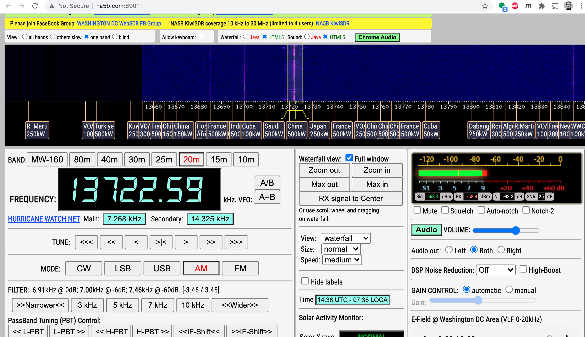

= The Hamster Handbook
Tim Born <Timothy.D.Born@gmail.com>
v0.4, July 26, 2021
:toclevels 5:
:icons: font
:toc2:
:imagesdir: ./

image::images/hamster-with-headphones.png[]

== Overview

Notes made by a ham newbie as he muddled his way through the learning curve.

= Scenarios

. just chatting ("rag chew")
. automatic position reporting (see APRS)
. operating remotely - QRM, solar powered
. operating remotely - canyons and other obstacles
. disaster assistance - reconnecting to a net, operating in a net, operating the net

= Morse Code

For completeness, Morse code (CW) is included.
It requires you to learn Morse, however.
From many perspectives, CW is optimal - low bandwidth, low power, it can get through whenm voice cannot, and the kit to start operating is probably the least expensive -- assuming you can get past the 'learn Morse' part.

Morse code used to be called Continuous Wave (CW).

= Voice

AM, FM, side band

= Digital Modes

It appears that digital is where a lot of the experimentation is happening.
While CW & voice are well understood and pretty stable, digital provides a ton of opportunities to play with protocols, error checking & correction, TDMA, data+voice and a ton of other things.

I'm attracted to digital modes because it appears it may be possible to get a message through with a low power transmitter when voice wouldn't cut it.

== Digital Voice

Who would have thought there would be competition in digital voice?
I see DMR on the European models, and that appears to be TDMA (duplexing two channels in one 12.5 kHz band).
As a standard, all vendors can mfgr this, and several do.

I see C4FM WIRES-X on Yaesu radios.
C4FM appears to refer to the digital voice, and WIRES-X appears to refer to linking across the internet.

AKA System Fusion?  Circa 2014?
Great audio quality.
Can mux voice & data.

other reflectors (repeaters?) that work with C4FM:

. FCS
. YSF?

ICOM likes D-STAR.  Japan Amateur Radio League, circa 2001.
Oldest digital format.

Internet is the weak link, and many of these look to be proprietary.

== ALE - Automatic Link Establishment

Problem: after a disaster how to hams reconnect with each other?

Solution: ALE is a set of fixed frequencies and a protocol for scanning those frequencies to find and reconnect hams to each other.

== APRS -

digipeater, iGate, microsat, aprsdroid

https://aprs.fi

== JS8CALL

???

== RTTY

**R**adio **T**ele**TY**pe - pretty vintage stuff, but still being used, apparently.

Tutorial for beginners and MMTTY software (MSWin only, alas) available at https://hamsoft.ca/pages/mmtty.php

. AFSK - ?

"LSB is the convention for AFSK"

== WinLink

WinLink - global radio email - https://www.winlink.org/

[quote, https://www.arednmesh.org/content/kenwood-tm-d710g-and-winlink]
____
\... there is even a setting in Winlink Packet for the D710.

All you need is USB-K5G cable either from
RT Systems https://www.rtsystemsinc.com/TM-D710-programming-software-and-USB-cable-s/1882.htm
or Amazon https://smile.amazon.com/Valley-Enterprises-Programming-TM-D710A-TM-D710E/dp/B072QDHT11
( Valley Enterprises version is not compatible with RT Systems, but works really well for programming the radio with Kenwood software and accessing the TNC)

You plug the USB side into the PC.
Plug the 8 pin accessory plug in the back of the head unit of the D710 labeled COM (NOT in the main body, that is the programming port).
Start a Winlink Packet or Packet P2P session.
Pick the D710 from the dropdown menu.
Pick the correct Serial Port for your USB cable.
Change the Maximum frames to 2.
Click OK.
Pick a frequency and you are off to the races.

Good forums for these questions are
https://groups.google.com/forum/\#!forum/winlink-programs-group
https://groups.google.com/forum/#!forum/winlink_for_emcomm

73,
Oliver K6OLI
____

https://www.arednmesh.org/content/kenwood-tm-d710g-and-winlink

= Antennas

== Antenna Design
If you want to analyze an antenna design, AFAIK the only free software left for this is https://www.qsl.net/4nec2/
It has a very steep learning curve, but it could be useful.
(extra credit: is the fractal antenna in White Collar really an antenna?  What properties do you get from the fractal shape?)

MMANA-GAL appears to be free antenna analysis software.
MSWin only, sadly.

== Mobile Antennas

If you can stomach it, the NMO mount looks the best, as it's a permanent mount on your roof.
Originally bought Browning BR-1015-UHF from Amazon ($24) but what I received has the chrome plating flaking off and the fit & finish are poor.

Considering swapping for Larsen NMOK mount, which is _reputed_ to be of better quality.

= Coolest Website Ever

Imagine being able to operate a ham radio (receive only) from your browser.
Practice dialing in signals and understanding the bands.
Thanks to Software Defined Radio [SDR] and some generous people, you can!

There is a list of other operating locations here:
http://websdr.org/

SDR is pretty magical, in that dozens of people can operate simultaneously.

= Projects

== Project #1 - APRS on the Cheap

Minimal materials to get experience with APRS.
Proposed solution: APRSdriod running on cell phone, connected to a dual band Handy Talkie (HT).

SITE for APRSdroid and where you can download it free

Phyical wiring and cable construction

operating APRSdroid - what can you do with it?

== Project #2 - WinLink on Kenwood TM-D710GA

https://www.kenwood.com/usa/com/amateur/tm-d710ga/[Kenwood TM-D710GA]

See the section on WinLink and replicate it by sending email over winlink on that radio.

. can you receive email?
. can you send/receive from e.g. gmail??

= Reference Materials

== Phonetic Alphabet

|===
|A |Alfa/Alpha |AL FAH
|B |Bravo |BRAH VOH
|C |Charlie |CHAR LEE
|D |Delta |DELL TAH
|E |Echo |ECK OH
|F |Foxtrot |FOKS TROT
|G |Golf |GOLF
|H |Hotel |HOH TELL
|I |India |IN DEE AH
|J |Juliett |JEW LEE ETT
|K |Kilo |KEY LOH
|L |Lima |LEE MAH
|M |Mike |MIKE
|N |November |NO VEMBER
|O |Oscar |OSS CAH
|P |Papa |PAH PAH
|Q |Quebec |KEH BECK
|R |Romeo |ROW ME OH
|S |Sierra |SEE AIRRAH
|T |Tango |TANG OH
|U |Uniform |YOU NEE FORM
|V |Victor |VIK TAH
|W |Whiskey |WISS KEY
|X |X-ray |ECKS RAY
|Y |Yankee |YANG KEY
|Z |Zulu |ZOO LOO
|===

== Q-Codes

Q-signals are a system of radio shorthand as old as wireless and developed from even older telegraphy codes. Q-signals are a set of abbreviations for common information that save time and allow communication between operators who don’t speak a common language. Modern ham radio uses them extensively. The table below lists the most common Q-signals used by hams. While Q-signals were developed for use by Morse operators, their use is common on phone, as well. You will often hear, “QRZed?” as someone asks “Who is calling me?” or “I’m getting a little QRM” from an operator receiving some interference or “Let’s QSY to 146.55” as two operators change from a repeater frequency to a nearby simplex communications frequency.

|===
|QRG |Your exact frequency (or that of ______) is _________kHz. Will you tell me my exact frequency (or that of __________)?
|QRL |I am busy (or I am busy with _________). Are you busy? Usually used to see if a frequency is busy.
|QRM |Your transmission is being interfered with _________ (1. Nil; 2. Slightly; 3. Moderately; 4. Severely; 5. Extremely.) Is my transmission being interfered with?
|QRN |I am troubled by static _________. (1 to 5 as under QRM.) Are you troubled by static?
|QRO |Increase power. Shall I increase power?
|QRP |Decrease power. Shall I decrease power?
|QRQ |Send faster (_________wpm). Shall I send faster?
|QRS |Send more slowly (_________wpm). Shall I send more slowly?
|QRT |Stop sending. Shall I stop sending?
|QRU |I have nothing for you. Have you anything for me?
|QRV |I am ready. Are you ready?
|QRX |I will call you again at ______hours (on ______kHz).  When will you call me again? Minutes are usually implied rather than hours.
|QRZ |You are being called by _________ (on ______kHz). Who is calling me?
|QSB |Your signals are fading. Are my signals fading?
|QSK |I can hear you between signals; break in on my transmission.  Can you hear me between your signals and if so can I break in on your transmission?
|QSL |I am acknowledging receipt.  Can you acknowledge receipt (of a message or transmission)?
|QSO |I can communicate with _________ direct (or relay through ______). Can you communicate with ______ direct or by relay?
|QSP |I will relay to ______. Will you relay to ______?
|QST |General call preceding a message addressed to all amateurs and ARRL members. This is in effect “CQ ARRL.”
|QSX |I am listening to ______ on ______kHz. Will you listen to ______on ______kHz?
|QSY |Change to transmission on another frequency (or on ______kHz).  Shall I change to transmission on another frequency (or on ______kHz)?
|QTC |I have ______messages for you (or for ______).  How many messages have you to send?
|QTH |My location is _________. What is your location?
|QTR |The time is _________. What is the correct time?

|===

REF: ARRL

== Band Chart

image::images/Band Chart.pdf[]

== International Call Sign Directory

|===
|Call Sign Series |Allocated To
|AAA-ALZ |United States of America
|AMA-AOZ |Spain
|APA-ASZ |Pakistan (Islamic Republic of)
|ATA-AWZ |India (Republic of)
|AXA-AXZ |Australia
|AYA-AZZ |Argentine Republic
|A2A-A2Z |Botswana (Republic of)
|A3A-A3Z |Tonga (Kingdom of)
|A4A-A4Z |Oman (Sultanate of)
|A5A-A5Z |Bhutan (Kingdom of)
|A6A-A6Z |United Arab Emirates
|A7A-A7Z |Qatar (State of)
|A8A-A8Z |Liberia (Republic of)
|A9A-A9Z |Bahrain (State of)
|BAA-BZZ |China (People's Republic of)
|CAA-CEZ |Chile
|CFA-CKZ |Canada
|CLA-CMZ |Cuba
|CNA-CNZ |Morocco (Kingdom of)
|COA-COZ |Cuba
|CPA-CPZ |Bolivia (Republic of)
|CQA-CUZ |Portugal
|CVA-CXZ |Uruguay (Eastern Republic of)
|CYA-CZZ |Canada
|C2A-C2Z |Nauru (Republic of)
|C3A-C3Z |Andorra (Principality of)
|C4A-C4Z |Cyprus (Republic of)
|C5A-C5Z |Gambia (Republic of the)
|C6A-C6Z |Bahamas (Commonwealth of the)
|* C7A-C7Z |World Meteorological Organization
|C8A-C9Z |Mozambique (Republic of)
|DAA-DRZ |Germany (Federal Republic of)
|DSA-DTZ |Korea (Republic of)
|DUA-DZZ |Philippines (Republic of the)
|D2A-D3Z |Angola (Republic of)
|D4A-D4Z |Cape Verde (Republic of)
|D5A-D5Z |Liberia (Republic of)
|D6A-D6Z |Comoros (Islamic Federal Republic of the)
|D7A-D9Z |Korea (Republic of)
|EAA-EHZ |Spain
|EIA-EJZ |Ireland
|EKA-EKZ |Armenia (Republic of)
|ELA-ELZ |Liberia (Republic of)
|EMA-EOZ |Ukraine
|EPA-EQZ |Iran (Islamic Republic of)
|ERA-ERZ |Moldova (Republic of)
|ESA-ESZ |Estonia (Republic of)
|ETA-ETZ |Ethiopia (Federal Democratic Republic of)
|EUA-EWZ |Belarus (Republic of)
|EXA-EXZ |Kyrgyz Republic
|EYA-EYZ |Tajikistan (Republic of)
|EZA-EZZ |Turkmenistan
|E2A-E2Z |Thailand
|E3A-E3Z |Eritrea
|** E4A-E4Z |Palestinian Authority
|E5A-E5Z |New Zealand - Cook Islands                     (WRC-07)
|E6A-E6Z |New Zealand - Niue
|E7A-E7Z |Bosnia and Herzegovina (Republic of)        (WRC-07)
|FAA-FZZ |France
|GAA-GZZ |United Kingdom of Great Britain and Northern Ireland
|HAA-HAZ |Hungary (Republic of)
|HBA-HBZ |Switzerland (Confederation of)
|HCA-HDZ |Ecuador
|HEA-HEZ |Switzerland (Confederation of)
|HFA-HFZ |Poland (Republic of)
|HGA-HGZ |Hungary (Republic of)
|HHA-HHZ |Haiti (Republic of)
|HIA-HIZ |Dominican Republic
|HJA-HKZ |Colombia (Republic of)
|HLA-HLZ |Korea (Republic of)
|HMA-HMZ |Democratic People's Republic of Korea
|HNA-HNZ |Iraq (Republic of)
|HOA-HPZ |Panama (Republic of)
|HQA-HRZ |Honduras (Republic of)
|HSA-HSZ |Thailand
|HTA-HTZ |Nicaragua
|HUA-HUZ |El Salvador (Republic of)
|HVA-HVZ |Vatican City State
|HWA-HYZ |France
|HZA-HZZ |Saudi Arabia (Kingdom of)
|H2A-H2Z |Cyprus (Republic of)
|H3A-H3Z |Panama (Republic of)
|H4A-H4Z |Solomon Islands
|H6A-H7Z |Nicaragua
|H8A-H9Z |Panama (Republic of)
|IAA-IZZ |Italy
|JAA-JSZ |Japan
|JTA-JVZ |Mongolia
|JWA-JXZ |Norway
|JYA-JYZ |Jordan (Hashemite Kingdom of)
|JZA-JZZ |Indonesia (Republic of)
|J2A-J2Z |Djibouti (Republic of)
|J3A-J3Z |Grenada
|J4A-J4Z |Greece
|J5A-J5Z |Guinea-Bissau (Republic of)
|J6A-J6Z |Saint Lucia
|J7A-J7Z |Dominica (Commonwealth of)
|J8A-J8Z |Saint Vincent and the Grenadines
|KAA-KZZ |United States of America
|LAA-LNZ |Norway
|LOA-LWZ |Argentine Republic
|LXA-LXZ |Luxembourg
|LYA-LYZ |Lithuania (Republic of)
|LZA-LZZ |Bulgaria (Republic of)
|L2A-L9Z |Argentine Republic
|MAA-MZZ |United Kingdom of Great Britain and Northern Ireland
|NAA-NZZ |United States of America
|OAA-OCZ |Peru
|ODA-ODZ |Lebanon
|OEA-OEZ |Austria
|OFA-OJZ |Finland
|OKA-OLZ |Czech Republic
|OMA-OMZ |Slovak Republic
|ONA-OTZ |Belgium
|OUA-OZZ |Denmark
|PAA-PIZ |Netherlands (Kingdom of the)
|PJA-PJZ |Netherlands (Kingdom of the) - Netherlands Caribbean
|PKA-POZ |Indonesia (Republic of)
|PPA-PYZ |Brazil (Federative Republic of)
|PZA-PZZ |Suriname (Republic of)
|P2A-P2Z |Papua New Guinea
|P3A-P3Z |Cyprus (Republic of)
|P4A-P4Z |Netherlands (Kingdom of the) - Aruba
|P5A-P9Z |Democratic People's Republic of Korea
|RAA-RZZ |Russian Federation
|SAA-SMZ |Sweden
|SNA-SRZ |Poland (Republic of)
|SSA-SSM |Egypt (Arab Republic of)
|SSN-STZ |Sudan (Republic of the)
|SUA-SUZ |Egypt (Arab Republic of)
|SVA-SZZ |Greece
|S2A-S3Z |Bangladesh (People's Republic of)
|S5A-S5Z |Slovenia (Republic of)
|S6A-S6Z |Singapore (Republic of)
|S7A-S7Z |Seychelles (Republic of)
|S8A-S8Z |South Africa (Republic of)
|S9A-S9Z |Sao Tome and Principe (Democratic Republic of)
|TAA-TCZ |Turkey
|TDA-TDZ |Guatemala (Republic of)
|TEA-TEZ |Costa Rica
|TFA-TFZ |Iceland
|TGA-TGZ |Guatemala (Republic of)
|THA-THZ |France
|TIA-TIZ |Costa Rica
|TJA-TJZ |Cameroon (Republic of)
|TKA-TKZ |France
|TLA-TLZ |Central African Republic
|TMA-TMZ |France
|TNA-TNZ |Congo (Republic of the)
|TOA-TQZ |France
|TRA-TRZ |Gabonese Republic
|TSA-TSZ |Tunisia
|TTA-TTZ |Chad (Republic of)
|TUA-TUZ |Côte d'Ivoire (Republic of)
|TVA-TXZ |France
|TYA-TYZ |Benin (Republic of)
|TZA-TZZ |Mali (Republic of)
|T2A-T2Z |Tuvalu
|T3A-T3Z |Kiribati (Republic of)
|T4A-T4Z |Cuba
|T5A-T5Z |Somali Democratic Republic
|T6A-T6Z |Afghanistan (Islamic State of)
|T7A-T7Z |San Marino (Republic of)
|T8A-T8Z |Palau (Republic of)
|UAA-UIZ |Russian Federation
|UJA-UMZ |Uzbekistan (Republic of)
|UNA-UQZ |Kazakhstan (Republic of)
|URA-UZZ |Ukraine
|VAA-VGZ |Canada
|VHA-VNZ |Australia
|VOA-VOZ |Canada
|VPA-VQZ |United Kingdom of Great Britain and Northern Ireland
|VRA-VRZ |China (People's Republic of) - Hong Kong
|VSA-VSZ |United Kingdom of Great Britain and Northern Ireland
|VTA-VWZ |India (Republic of)
|VXA-VYZ |Canada
|VZA-VZZ |Australia
|V2A-V2Z |Antigua and Barbuda
|V3A-V3Z |Belize
|V4A-V4Z |Saint Kitts and Nevis
|V5A-V5Z |Namibia (Republic of)
|V6A-V6Z |Micronesia (Federated States of)
|V7A-V7Z |Marshall Islands (Republic of the)
|V8A-V8Z |Brunei Darussalam
|WAA-WZZ |United States of America
|XAA-XIZ |Mexico
|XJA-XOZ |Canada
|XPA-XPZ |Denmark
|XQA-XRZ |Chile
|XSA-XSZ |China (People's Republic of)
|XTA-XTZ |Burkina Faso
|XUA-XUZ |Cambodia (Kingdom of)
|XVA-XVZ |Viet Nam (Socialist Republic of)
|XWA-XWZ |Lao People's Democratic Republic
|XXA-XXZ |China (People's Republic of) - Macao        (WRC-07)
|XYA-XZZ |Myanmar (Union of)
|YAA-YAZ |Afghanistan (Islamic State of)
|YBA-YHZ |Indonesia (Republic of)
|YIA-YIZ |Iraq (Republic of)
|YJA-YJZ |Vanuatu (Republic of)
|YKA-YKZ |Syrian Arab Republic
|YLA-YLZ |Latvia (Republic of)
|YMA-YMZ |Turkey
|YNA-YNZ |Nicaragua
|YOA-YRZ |Romania
|YSA-YSZ |El Salvador (Republic of)
|YTA-YUZ |Serbia (Republic of)                                 (WRC-07)
|YVA-YYZ |Venezuela (Republic of)
|Y2A-Y9Z |Germany (Federal Republic of)
|ZAA-ZAZ |Albania (Republic of)
|ZBA-ZJZ |United Kingdom of Great Britain and Northern Ireland
|ZKA-ZMZ |New Zealand
|ZNA-ZOZ |United Kingdom of Great Britain and Northern Ireland
|ZPA-ZPZ |Paraguay (Republic of)
|ZQA-ZQZ |United Kingdom of Great Britain and Northern Ireland
|ZRA-ZUZ |South Africa (Republic of)
|ZVA-ZZZ |Brazil (Federative Republic of)
|Z2A-Z2Z |Zimbabwe (Republic of)
|Z3A-Z3Z |North Macedonia (Republic of)
|Z6A-Z6Z |Kosovo (Republic of)
|Z8A-Z8Z |South Sudan (Republic of)
|2AA-2ZZ |United Kingdom of Great Britain and Northern Ireland
|3AA-3AZ |Monaco (Principality of)
|3BA-3BZ |Mauritius (Republic of)
|3CA-3CZ |Equatorial Guinea (Republic of)
|3DA-3DM |Kingdom of Eswatini
|3DN-3DZ |Fiji (Republic of)
|3EA-3FZ |Panama (Republic of)
|3GA-3GZ |Chile
|3HA-3UZ |China (People's Republic of)
|3VA-3VZ |Tunisia
|3WA-3WZ |Viet Nam (Socialist Republic of)
|3XA-3XZ |Guinea (Republic of)
|3YA-3YZ |Norway
|3ZA-3ZZ |Poland (Republic of)
|4AA-4CZ |Mexico
|4DA-4IZ |Philippines (Republic of the)
|4JA-4KZ |Azerbaijani Republic
|4LA-4LZ |Georgia (Republic of)
|4MA-4MZ |Venezuela (Republic of)
|4OA-4OZ |Montenegro (Republic of)                   (WRC-07)
|4PA-4SZ |Sri Lanka (Democratic Socialist Republic of)
|4TA-4TZ |Peru
|* 4UA-4UZ |United Nations
|4VA-4VZ |Haiti (Republic of)
|4WA-4WZ |Democratic Republic of Timor-Leste   (WRC-03)
|4XA-4XZ |Israel (State of)
|* 4YA-4YZ |International Civil Aviation Organization
|4ZA-4ZZ |Israel (State of)
|5AA-5AZ |Libya (Socialist People's Libyan Arab Jamahiriya)
|5BA-5BZ |Cyprus (Republic of)
|5CA-5GZ |Morocco (Kingdom of)
|5HA-5IZ |Tanzania (United Republic of)
|5JA-5KZ |Colombia (Republic of)
|5LA-5MZ |Liberia (Republic of)
|5NA-5OZ |Nigeria (Federal Republic of)
|5PA-5QZ |Denmark
|5RA-5SZ |Madagascar (Republic of)
|5TA-5TZ |Mauritania (Islamic Republic of)
|5UA-5UZ |Niger (Republic of the)
|5VA-5VZ |Togolese Republic
|5WA-5WZ |Samoa (Independent State of)
|5XA-5XZ |Uganda (Republic of)
|5YA-5ZZ |Kenya (Republic of)
|6AA-6BZ |Egypt (Arab Republic of)
|6CA-6CZ |Syrian Arab Republic
|6DA-6JZ |Mexico
|6KA-6NZ |Korea (Republic of)
|6OA-6OZ |Somali Democratic Republic
|6PA-6SZ |Pakistan (Islamic Republic of)
|6TA-6UZ |Sudan (Republic of the)
|6VA-6WZ |Senegal (Republic of)
|6XA-6XZ |Madagascar (Republic of)
|6YA-6YZ |Jamaica
|6ZA-6ZZ |Liberia (Republic of)
|7AA-7IZ |Indonesia (Republic of)
|7JA-7NZ |Japan
|7OA-7OZ |Yemen (Republic of)
|7PA-7PZ |Lesotho (Kingdom of)
|7QA-7QZ |Malawi
|7RA-7RZ |Algeria (People's Democratic Republic of)
|7SA-7SZ |Sweden
|7TA-7YZ |Algeria (People's Democratic Republic of)
|7ZA-7ZZ |Saudi Arabia (Kingdom of)
|8AA-8IZ |Indonesia (Republic of)
|8JA-8NZ |Japan
|8OA-8OZ |Botswana (Republic of)
|8PA-8PZ |Barbados
|8QA-8QZ |Maldives (Republic of)
|8RA-8RZ |Guyana
|8SA-8SZ |Sweden
|8TA-8YZ |India (Republic of)
|8ZA-8ZZ |Saudi Arabia (Kingdom of)
|9AA-9AZ |Croatia (Republic of)
|9BA-9DZ |Iran (Islamic Republic of)
|9EA-9FZ |Ethiopia (Federal Democratic Republic of)
|9GA-9GZ |Ghana
|9HA-9HZ |Malta
|9IA-9JZ |Zambia (Republic of)
|9KA-9KZ |Kuwait (State of)
|9LA-9LZ |Sierra Leone
|9MA-9MZ |Malaysia
|9NA-9NZ |Nepal
|9OA-9TZ |Democratic Republic of the Congo
|9UA-9UZ |Burundi (Republic of)
|9VA-9VZ |Singapore (Republic of)
|9WA-9WZ |Malaysia
|9XA-9XZ |Rwandese Republic
|9YA-9ZZ |Trinidad and Tobago
|===

http://www.arrl.org/international-call-sign-series

= References

. ARRL - American Radio Relay League.  arrl.org
. 4NEC2 - "NEC based antenna modeler and optimizer
by Arie Voors", https://www.qsl.net/4nec2/
. MMANA-GAL - antenna analysis software, https://hamsoft.ca/pages/mmana-gal.php

