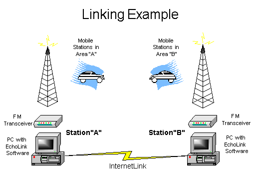
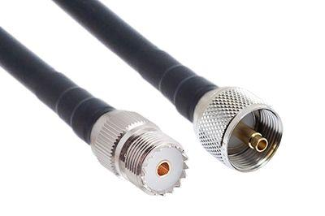
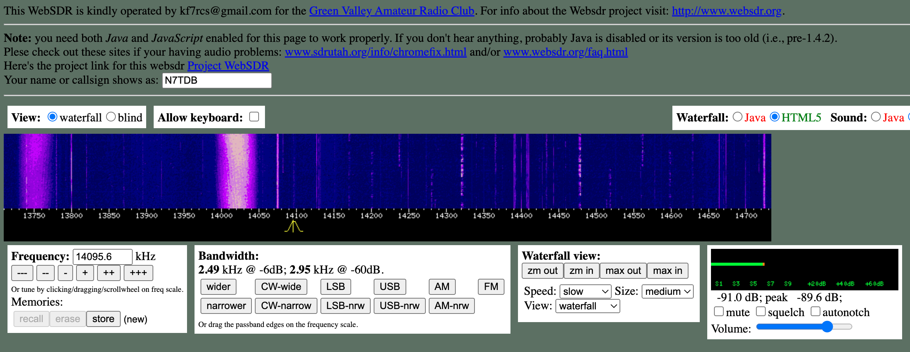
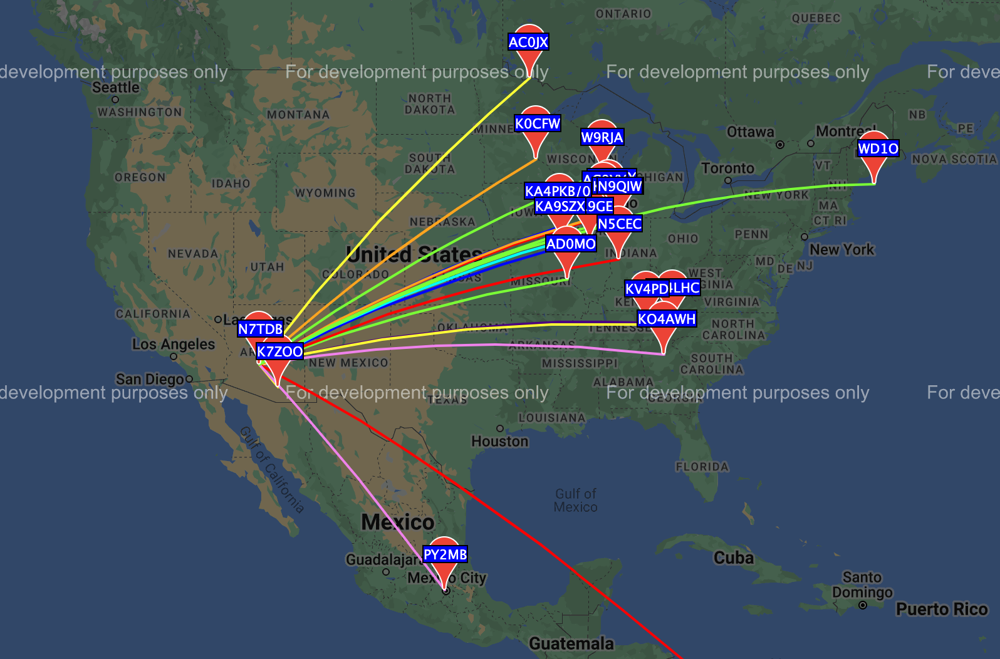
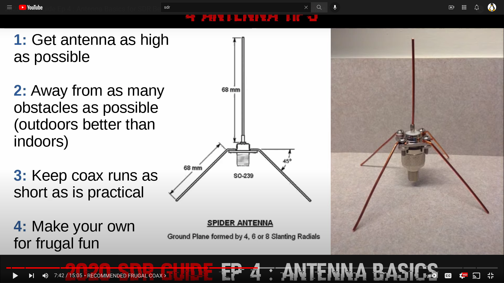
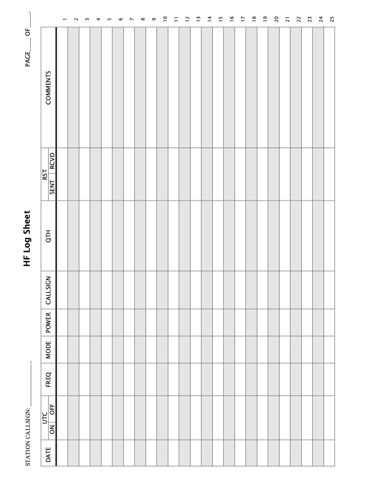

= The Hamster Handbook
Tim Born <Timothy.D.Born@gmail.com>
v0.8, June 11, 2022
:toclevels 5:
:icons: font
:toc2:
:imagesdir: ./

image::images/hamster-with-headphones.png[]

== Overview

Notes made by a ham newbie as he muddled his way through the learning curve.

== Scenarios

. just chatting ("rag chew")
. automatic position reporting (see APRS)
. operating remotely - QRM, solar-powered
. operating remotely - canyons and other obstacles
. disaster assistance - reconnecting to a net, operating in a net, operating the net

== Morse Code

For completeness, Morse code (CW) is included.
It requires you to learn Morse, however.
From many perspectives, CW is optimal - low bandwidth, low power, it can get through when voice cannot, and the kit to start operating is probably the least expensive -- assuming you can get past the 'learn Morse' part.

Morse code used to be called Continuous Wave (CW).

I guess _technically_ CW is 'digital' and not some strange third type, so this section probably belongs under "Digital Modes".

== Voice

AM, FM, sideband

=== EchoLink

EchoLink is voice + text messaging (depending on how you connect).
The idea is to extend the reach by connecting "nodes" across the internet.
You access a local node, squirt across the inet and finish the last mile from the radio at the far-end node.

EchoLink node 598882 NY7S-R is West Valley Amateur Radio Club node.

EchoLink node N2QOJ-R runs Central Arizona Youth Net on Sundays at 5pm.

K7UGS Karen likes and uses EchoLink.
I see Karen is operating EchoLink on a Samsung Galaxy S9 from Oregon!
Apparently there is EchoLink for Android!

The EchoLink website says it does not run on Mac but they recommend EchoHam from the app store.

I was able to install EchoLink software on a Win11 VM, connect a USB microphone (it didn't like my bluetooth microphone) and bluetooth speakers and listened in on the Central Arizona Youth Net that meets Sunday nights (N2QOJ-R).

- Net Control is Landon AI7HE.
- Promoter/sponsor appears to be Joe Sammarino N2QOJ.

== Digital Modes

It appears that digital is where a lot of the experimentation is happening.
While CW & voice are well understood and pretty stable, digital provides a ton of opportunities to play with protocols, error checking & correction, TDMA, data+voice and a ton of other things.

I'm attracted to digital modes because it appears it may be possible to get a message through with a low power transmitter when voice wouldn't cut it.

=== Digital Voice

Who would have thought there would be competition in digital voice?
I see DMR on the European models, and that appears to be TDMA (duplexing two channels in one 12.5 kHz band).
As a standard, all vendors can mfgr this, and several do.

I see C4FM WIRES-X on Yaesu radios.
C4FM appears to refer to the digital voice, and WIRES-X appears to refer to linking across the internet.

AKA System Fusion?  Circa 2014?
Great audio quality.
Can mux voice & data.

other reflectors (repeaters?) that work with C4FM:

. FCS
. YSF?

ICOM likes D-STAR.  Japan Amateur Radio League, circa 2001.
Oldest digital format.

Internet is the weak link, and many of these look to be proprietary.

=== Packet

How does "packet" relate to APRS or WinLink?
Or is "packet" some separate thingy?

[quote, wikipedia]
____
"Since the late 1990s, most AX.25 usage has shifted to a different one-to-many communication paradigm with the Automatic Packet Reporting System (APRS)".
____

Check out YouTube for Denver Radio Club "DRC Packet Radio Class 01".
Circa 1992 but it has the details and the history.
Excellent.

=== TNC - Terminal Node Controller

The TNC shows up in many of the digital packet solutions.
A TNC is like a modem in that it talks analog (tones) to the radio and digital messages to the computer.
The protocol appears to (often?  always?) be AX.25.

image::images/TNC.png[]

There are lots of dead solutions out there.
Mobilinkd appears to be one of the few hardware solutions still going.
https://github.com/wb2osz/direwolf[Direwolf] is a software solution (multiple platforms) that leverages the considerable processing power in todays computers plugs the audio cards.

Apparently packets work pretty well on VHF but on HF the noise and contention is often a problem, so some people are experimenting with packets not using AX.25.

http://wa8lmf.net/FLdigiAPRS/index.htm["Using FLdigi For APRS Over Non-AX.25 Modes"], Stephen H. Smith

FLdigi is similar to Direwolf in that it is software, but it is not operating on AX.25.
It does, however, leverage the soundcard on your computer as a DSP to construct and decode the tones.

=== ALE - Automatic Link Establishment

Problem: after a disaster how to hams reconnect with each other?

Solution: ALE is a set of fixed frequencies and a protocol for scanning those frequencies to find and reconnect hams to each other.

=== APRS - Automatic Packet Reporting System

Don't make the mistake of calling it 'Automatic Position Reporting System' or Bob will get annoyed.

digipeater, iGate, microsat, aprsdroid

https://aprs.fi

https://smsgte.org/[SMSGTE] is a way to bridge APRS messaging and SMS (cell phone texting).

=== FT-8

Install WSJTX ('brew install wsjtx' on a mac).

==== What Is FT-8? / Why Use FT-8?

FT-8 is one of many digital modes.
As such it is very efficient, able to get out a signal on low power over great distances, and decode msgs even below the level of human hearing.

FT-8 has a protocol for making contacts, but is not suitable for rag chewing.
See JS8CALL or PSK31.

==== How To Set Up FT-8?

Make sure your callsign and grid square are set correctly.

settings / general

- double click on call sets TX enable
- disable TX after sending 73
- calling CQ forces call 1st

Logging?
Perhaps http://www.dl2rum.de/rumsoft/RUMLog.html[RUMlogNG] (mac app store) coupled with http://jt-bridge.eller.nu/[JT-Bridge] (brew!) to xlate from WSJTX to RUMlogNG.

==== Using FT-8

NB FT-8 uses split frequencies!

==== WHAT FREQ TO USE?

. https://www.g4ifb.com/FT8_Hinson_tips_for_HF_DXers.pdf[FT8 Operating Guide] Weak signal HF DXing for technophiles  by Gary Hinson ZL2iFB

=== JS8CALL

Julian OH8STN likes JS8CALL for actual comms during emergencies.
Works well with low power.
Appears to be point-to-point rather than email.

APRS Messanger is obsolete.
The developer recommends using JS8CALL.

=== RTTY

**R**adio **T**ele**TY**pe - pretty vintage stuff, but still being used, apparently.

Tutorial for beginners and MMTTY software (MSWin only, alas) available at https://hamsoft.ca/pages/mmtty.php

https://blackcatsystems.com/software/multimode/rtty.html[MultiMode] (commercial) runs on a mac and will decode RTTY.

Seems like the RPi would be a natural for RTTY.

. AFSK - ?

"LSB is the convention for AFSK"

=== WinLink

WinLink - global radio email - https://www.winlink.org/

https://woad.sumusltd.com/[WoAD] is a WinLink client that runs on Android.
This looks promising.

[quote, https://www.arednmesh.org/content/kenwood-tm-d710g-and-winlink]
____
\... there is even a setting in Winlink Packet for the D710.

All you need is USB-K5G cable either from
RT Systems https://www.rtsystemsinc.com/TM-D710-programming-software-and-USB-cable-s/1882.htm
or Amazon https://smile.amazon.com/Valley-Enterprises-Programming-TM-D710A-TM-D710E/dp/B072QDHT11
( Valley Enterprises version is not compatible with RT Systems, but works really well for programming the radio with Kenwood software and accessing the TNC)

You plug the USB side into the PC.
Plug the 8 pin accessory plug in the back of the head unit of the D710 labeled COM (NOT in the main body, that is the programming port).
Start a Winlink Packet or Packet P2P session.
Pick the D710 from the dropdown menu.
Pick the correct Serial Port for your USB cable.
Change the Maximum frames to 2.
Click OK.
Pick a frequency and you are off to the races.

Good forums for these questions are
https://groups.google.com/forum/\#!forum/winlink-programs-group
https://groups.google.com/forum/#!forum/winlink_for_emcomm

73,
Oliver K6OLI
____

https://www.arednmesh.org/content/kenwood-tm-d710g-and-winlink

== Antennas

=== Antenna Design
If you want to analyze an antenna design, AFAIK the only free software left for this is https://www.qsl.net/4nec2/
It has a very steep learning curve, but it could be useful.
(extra credit: is the fractal antenna in White Collar really an antenna?  What properties do you get from the fractal shape?)

MMANA-GAL appears to be free antenna analysis software.
MSWin only, sadly.

==== Calculating The Antenna Length For A Halfwave Dipole

The length of a dipole is found by

- 143 / freq = meters
- 468 / freq = feet

Each of the two radials would then be exactly half that calculated length for the halfwave dipole.

Wait.  What?  I was taught

wavelength = speed of light / frequency = 300 m/s / freq ==> meters

What's this "143" stuff?
Well, part of it is the *halfwave* dipole, so I expected 150.
The rest is, perhaps, reality bites for speed of radio through air & copper.  Maybe.

=== Mobile Antennas

If you can stomach it, the NMO mount looks the best, as it's a permanent mount on your roof.
Originally bought Browning BR-1015-UHF from Amazon ($24) but what I received has the chrome plating flaking off and the fit & finish are poor.

Considering swapping for Larsen NMOK mount, which is _reputed_ to be of better quality.

=== Antenna Standards

[quote, Andrew Tanenbaum]
The nice thing about standards is that you have so many to choose from.

[quote, https://www.arcantenna.com/blogs/news/uhf-pl259-so239-what-is-the-difference]
Typically, the SO-239 (UHF Female/UHF Jack) is installed ON THE RADIO, and the PL-259 (UHF Male/UHF Plug) is installed ON THE CABLE.  The two "mate" and are collectively known as a UHF Connection.

For most desktop and mobile radios, the radio will have a female SO-239 connector.
Likewise, many (not all) antenna bases will have female SO-239 connector,
Therefore, typical 50 ohm coax with male PL-259 connectors on both ends would be used to connect radio to antenna.

Handheld radios tend to have SMA connectors.
There doesn't appear to be any standard usage of male vs female, unfortunately.

Occasionally you find BNC connectors being used.
Not clear when or why.

=== Antenna Vendors

https://edsantennas.weebly.com[Ed's Antennas] are pretty sane looking 2M/1.25M/70cm antennas.

== Radios

=== QRP Labs QDX (SDR)

This is an SDR radio, covering 4 HF bands at 5W.
It's a kit that ends up about the size of a deck of cards.
$60 for the kit, $80 if you include the case.

Pros:

. micro size and small price!
. perfect for all those digital modes
. SINGLE USB CABLE between computer and radio.  Genius!

Cons

. it's a kit
. it sold out immediately and the global parts shortage is delaying resupply
. it uses 9V instead of 12V.  Why?

Watch this in future.  Expect 12V power and assembled radios at a higher price.
Still probably the closest to perfect for digital on HF.

=== RTL-SDR V3

Featured on Frugal Radio on YouTube.

Typical SDR features:

. Spectrum Analyzer!
. multiple VFOs, so you can listen on multiple broadcasts simultaneously.

=== Nooelec SMARt V4 (SDR)

Featured on Frugal Radio on YouTube.

=== Generic DVB (SDR)

Featured on Frugal Radio on YouTube.

=== AirSpy (SDR)

Featured on Frugal Radio on YouTube.

https://airspy.com/[AirSpy].
He demoed

=== ADALM-PLUTO (SDR)

Featured on Frugal Radio on YouTube.

== Free SDRs Online

Featured on Frugal Radio on YouTube.

. kiwisdr.com - worldwide list of receivers, despite the name
. websdr.org

In demo he routed audio from free web SDL to his decoder using PC-HFDL.
HFDL (High Frequency Data Link) is the generic term for a system in use by long haul airlines for aircraft tracking and text messaging.

== SDR Software
There appears to be lots of SDR software for MSWin.

For the mac:

. CubicSDR (https://learn.adafruit.com/getting-started-with-rtl-sdr-and-sdr-sharp/cubicsdr-for-mac-os[short turorial])
. airspy (which version?) seems to be available through Brew
. https://gqrx.dk/[GQRX]
. https://github.com/DSheirer/sdrtrunk[SDRTrunk]

You may need to route the audio in some complex ways.
Virtual Audio Cable works for MSWin only.
Nearest mac solution appears to be https://vb-audio.com/Cable/

https://www.rtl-sdr.com/tag/dragonos/[DragonOS] is a linux solution for RPi with SDR software preloaded.
This may be worth looking at.

See Also Radio Reference https://www.radioreference.com/[website] for loads of reference data, especially for trunking.

== Coolest Website Ever

Imagine being able to operate a ham radio (receive only) from your browser.
Practice dialing in signals and understanding the bands.
Thanks to Software Defined Radio [SDR] and some generous people, you can!

image::images/NA5B-SDR.png[]

There is a list of other operating locations here:
http://websdr.org/

SDR is pretty magical, in that dozens of people can operate simultaneously.

== Projects

=== Project #1 - APRS on the Cheap

Minimal materials to get experience with APRS.
Proposed solution: APRSdriod running on cell phone, connected to a dual-band Handy Talkie (HT).

SITE for APRSdroid and where you can download it free

Physical wiring and cable construction

operating APRSdroid - what can you do with it?

=== Project #2 - EchoLink on the Cheap

See the section on EchoLink.
Install on a PC.
Join the Sunday night net using your computer (or android).

=== Project #3 - WinLink on Android

See the section on WinLink and replicate it by sending email over winlink on Tera HT (using the cable from project #1 above).

. can you receive email?
. can you send/receive from e.g. gmail??
. can you replicate this with mobile radio in your truck?

How does the choice of SSID affect this?
What would a sane policy for using SSID with WinLink be?

=== Project #4 - Listen to the International Space Station

Even with a handheld, if you know the frequency and when to expect them, you can always listen in.

https://spotthestation.nasa.gov/sightings/view.cfm?country=United_States&region=Arizona&city=Phoenix#.YQBMBRNKg-Q

=== Project #5 - See How Far You Can Whisper

Using something like WSTJ-X and the WSPR protocol, you can experiment to see how far you can actually go on a few watts (or less!).
Multi-platform, multiband, cool mapping tool to see your results.

https://physics.princeton.edu/pulsar/k1jt/wspr.html[WSPR]

April 2022 - I still don't have an HF radio yet, so I "borrowed" a websdr at http://44.127.32.234:8901/.
Tune it to 14095.6 kHz, which is the WSPR freq for 20 meters.

You wire up the audio from your web browser to WSJT-X using VB-Cable for mac.
You must set the audio to 48,000 samples per second all the way through the chain!
You do this using the MIDI controls on the mac (not the audio controls).

In WSJT-X Preferences

. general: your call sign and grid locator
. radio: rig=none
. audio: input=VB-Cable, output=mac speakers

Mode = WSPR (the frequency should automatically switch to 14095.6 if you are on 20M).

If you wait a few minutes you will start to see WSPR signals from all over the country!

You can go to https://www.wsprnet.org/drupal/wsprnet/map[WSPR websight] and see a map of your contacts (assuming you enabled preferences / reporting / enable PSK reporter spotting).

When I get a radio I would like to repeat this using my own rig and antenna.

=== Project #6 - Send A Text Message From Your Radio

Try using https://smsgte.org/[SMSGTE] to connect (bi-directionally!) your APRS-enabled radio with SMS.

=== Project #7 - Build A UHF/VHF Antenna

See https://www.arrl.org/files/file/Get%20Licensed/Quickstart%20Guide%20EBOOK.pdf[ARRL Quickstart Guide For All Hams], page 12, "Build A Portable Ground Plane Antenna", by Zack Lau, W1VT.

It seems cheap and simple, and you don't need an SWR meter.
These are measurements for UHF & VHF antennas.

NB VX-6R can operate on 70 cm, 1.25 M and 2 M, so potentially three antennas.
Can this same design work for receiving on other frequencies?

=== Project #8 - Build Spider Antenna for SDR (ADS-B)

https://www.amateurradiosupplies.com/product-p/cz7520.htm - UHF Male to F Female adapter.
You will want this to connect SO239 on antenna to the F-connector on the RG6 (assuming you use the cheap coax).

ADS-B is air traffic, centered around 1090 MHz.
300/1090 = 0.275M or 27.5 cm for the full wavelength.
The measurements in that picture are for 1/4 &#955;, thus the 6.8 cm.

I believe this is the original post: https://discussions.flightaware.com/t/three-easy-diy-antennas-for-beginners/16348

This is a subsequent post from someone else that adds more details: https://lucsmall.com/2017/02/06/making-antennas-for-1090mhz-ads-b-aircraft-tracking/

== Reference Materials

=== Phonetic Alphabet

|===
|A |Alfa/Alpha |AL FAH
|B |Bravo |BRAH VOH
|C |Charlie |CHAR LEE
|D |Delta |DELL TAH
|E |Echo |ECK OH
|F |Foxtrot |FOKS TROT
|G |Golf |GOLF
|H |Hotel |HOH TELL
|I |India |IN DEE AH
|J |Juliett |JEW LEE ETT
|K |Kilo |KEY LOH
|L |Lima |LEE MAH
|M |Mike |MIKE
|N |November |NO VEMBER
|O |Oscar |OSS CAH
|P |Papa |PAH PAH
|Q |Quebec |KEH BECK
|R |Romeo |ROW ME OH
|S |Sierra |SEE AIRRAH
|T |Tango |TANG OH
|U |Uniform |YOU NEE FORM
|V |Victor |VIK TAH
|W |Whiskey |WISS KEY
|X |X-ray |ECKS RAY
|Y |Yankee |YANG KEY
|Z |Zulu |ZOO LOO
|===

=== Q-Codes

Q-signals are a system of radio shorthand as old as wireless and developed from even older telegraphy codes. Q-signals are a set of abbreviations for common information that save time and allow communication between operators who don’t speak a common language. Modern ham radio uses them extensively. The table below lists the most common Q-signals used by hams. While Q-signals were developed for use by Morse operators, their use is common on phone, as well. You will often hear, “QRZed?” as someone asks “Who is calling me?” or “I’m getting a little QRM” from an operator receiving some interference or “Let’s QSY to 146.55” as two operators change from a repeater frequency to a nearby simplex communications frequency.

|===
|QRG |Your exact frequency (or that of ______) is _________kHz. Will you tell me my exact frequency (or that of __________)?
|QRL |I am busy (or I am busy with _________). Are you busy? Usually used to see if a frequency is busy.
|QRM |Your transmission is being interfered with _________ (1. Nil; 2. Slightly; 3. Moderately; 4. Severely; 5. Extremely.) Is my transmission being interfered with?
|QRN |I am troubled by static _________. (1 to 5 as under QRM.) Are you troubled by static?
|QRO |Increase power. Shall I increase power?
|QRP |Decrease power. Shall I decrease power?
|QRQ |Send faster (_________wpm). Shall I send faster?
|QRS |Send more slowly (_________wpm). Shall I send more slowly?
|QRT |Stop sending. Shall I stop sending?
|QRU |I have nothing for you. Have you anything for me?
|QRV |I am ready. Are you ready?
|QRX |I will call you again at ______hours (on ______kHz).  When will you call me again? Minutes are usually implied rather than hours.
|QRZ |You are being called by _________ (on ______kHz). Who is calling me?
|QSB |Your signals are fading. Are my signals fading?
|QSK |I can hear you between signals; break in on my transmission.  Can you hear me between your signals and if so can I break in on your transmission?
|QSL |I am acknowledging receipt.  Can you acknowledge receipt (of a message or transmission)?
|QSO |I can communicate with _________ direct (or relay through ______). Can you communicate with ______ direct or by relay?
|QSP |I will relay to ______. Will you relay to ______?
|QST |General call preceding a message addressed to all amateurs and ARRL members. This is in effect “CQ ARRL.”
|QSX |I am listening to ______ on ______kHz. Will you listen to ______on ______kHz?
|QSY |Change to transmission on another frequency (or on ______kHz).  Shall I change to transmission on another frequency (or on ______kHz)?
|QTC |I have ______messages for you (or for ______).  How many messages have you to send?
|QTH |My location is _________. What is your location?
|QTR |The time is _________. What is the correct time?

|===

REF: ARRL

=== Band Chart

image::images/Band Chart.pdf[]

=== International Call Sign Directory

|===
|Call Sign Series |Allocated To
|AAA-ALZ |United States of America
|AMA-AOZ |Spain
|APA-ASZ |Pakistan (Islamic Republic of)
|ATA-AWZ |India (Republic of)
|AXA-AXZ |Australia
|AYA-AZZ |Argentine Republic
|A2A-A2Z |Botswana (Republic of)
|A3A-A3Z |Tonga (Kingdom of)
|A4A-A4Z |Oman (Sultanate of)
|A5A-A5Z |Bhutan (Kingdom of)
|A6A-A6Z |United Arab Emirates
|A7A-A7Z |Qatar (State of)
|A8A-A8Z |Liberia (Republic of)
|A9A-A9Z |Bahrain (State of)
|BAA-BZZ |China (People's Republic of) (see carve-out for Taiwan below)
|BM-BQ, BU-BX |Taiwan
|CAA-CEZ |Chile
|CFA-CKZ |Canada
|CLA-CMZ |Cuba
|CNA-CNZ |Morocco (Kingdom of)
|COA-COZ |Cuba
|CPA-CPZ |Bolivia (Republic of)
|CQA-CUZ |Portugal
|CVA-CXZ |Uruguay (Eastern Republic of)
|CYA-CZZ |Canada
|C2A-C2Z |Nauru (Republic of)
|C3A-C3Z |Andorra (Principality of)
|C4A-C4Z |Cyprus (Republic of)
|C5A-C5Z |Gambia (Republic of the)
|C6A-C6Z |Bahamas (Commonwealth of the)
|* C7A-C7Z |World Meteorological Organization
|C8A-C9Z |Mozambique (Republic of)
|DAA-DRZ |Germany (Federal Republic of)
|DSA-DTZ |Korea (Republic of)
|DUA-DZZ |Philippines (Republic of the)
|D2A-D3Z |Angola (Republic of)
|D4A-D4Z |Cape Verde (Republic of)
|D5A-D5Z |Liberia (Republic of)
|D6A-D6Z |Comoros (Islamic Federal Republic of the)
|D7A-D9Z |Korea (Republic of)
|EAA-EHZ |Spain
|EIA-EJZ |Ireland
|EKA-EKZ |Armenia (Republic of)
|ELA-ELZ |Liberia (Republic of)
|EMA-EOZ |Ukraine
|EPA-EQZ |Iran (Islamic Republic of)
|ERA-ERZ |Moldova (Republic of)
|ESA-ESZ |Estonia (Republic of)
|ETA-ETZ |Ethiopia (Federal Democratic Republic of)
|EUA-EWZ |Belarus (Republic of)
|EXA-EXZ |Kyrgyz Republic
|EYA-EYZ |Tajikistan (Republic of)
|EZA-EZZ |Turkmenistan
|E2A-E2Z |Thailand
|E3A-E3Z |Eritrea
|** E4A-E4Z |Palestinian Authority
|E5A-E5Z |New Zealand - Cook Islands                     (WRC-07)
|E6A-E6Z |New Zealand - Niue
|E7A-E7Z |Bosnia and Herzegovina (Republic of)        (WRC-07)
|FAA-FZZ |France
|GAA-GZZ |United Kingdom of Great Britain and Northern Ireland
|HAA-HAZ |Hungary (Republic of)
|HBA-HBZ |Switzerland (Confederation of)
|HCA-HDZ |Ecuador
|HEA-HEZ |Switzerland (Confederation of)
|HFA-HFZ |Poland (Republic of)
|HGA-HGZ |Hungary (Republic of)
|HHA-HHZ |Haiti (Republic of)
|HIA-HIZ |Dominican Republic
|HJA-HKZ |Colombia (Republic of)
|HLA-HLZ |Korea (Republic of)
|HMA-HMZ |Democratic People's Republic of Korea
|HNA-HNZ |Iraq (Republic of)
|HOA-HPZ |Panama (Republic of)
|HQA-HRZ |Honduras (Republic of)
|HSA-HSZ |Thailand
|HTA-HTZ |Nicaragua
|HUA-HUZ |El Salvador (Republic of)
|HVA-HVZ |Vatican City State
|HWA-HYZ |France
|HZA-HZZ |Saudi Arabia (Kingdom of)
|H2A-H2Z |Cyprus (Republic of)
|H3A-H3Z |Panama (Republic of)
|H4A-H4Z |Solomon Islands
|H6A-H7Z |Nicaragua
|H8A-H9Z |Panama (Republic of)
|IAA-IZZ |Italy
|JAA-JSZ |Japan
|JTA-JVZ |Mongolia
|JWA-JXZ |Norway
|JYA-JYZ |Jordan (Hashemite Kingdom of)
|JZA-JZZ |Indonesia (Republic of)
|J2A-J2Z |Djibouti (Republic of)
|J3A-J3Z |Grenada
|J4A-J4Z |Greece
|J5A-J5Z |Guinea-Bissau (Republic of)
|J6A-J6Z |Saint Lucia
|J7A-J7Z |Dominica (Commonwealth of)
|J8A-J8Z |Saint Vincent and the Grenadines
|KAA-KZZ |United States of America
|LAA-LNZ |Norway
|LOA-LWZ |Argentine Republic
|LXA-LXZ |Luxembourg
|LYA-LYZ |Lithuania (Republic of)
|LZA-LZZ |Bulgaria (Republic of)
|L2A-L9Z |Argentine Republic
|MAA-MZZ |United Kingdom of Great Britain and Northern Ireland
|NAA-NZZ |United States of America
|OAA-OCZ |Peru
|ODA-ODZ |Lebanon
|OEA-OEZ |Austria
|OFA-OJZ |Finland
|OKA-OLZ |Czech Republic
|OMA-OMZ |Slovak Republic
|ONA-OTZ |Belgium
|OUA-OZZ |Denmark
|PAA-PIZ |Netherlands (Kingdom of the)
|PJA-PJZ |Netherlands (Kingdom of the) - Netherlands Caribbean
|PKA-POZ |Indonesia (Republic of)
|PPA-PYZ |Brazil (Federative Republic of)
|PZA-PZZ |Suriname (Republic of)
|P2A-P2Z |Papua New Guinea
|P3A-P3Z |Cyprus (Republic of)
|P4A-P4Z |Netherlands (Kingdom of the) - Aruba
|P5A-P9Z |Democratic People's Republic of Korea
|RAA-RZZ |Russian Federation
|SAA-SMZ |Sweden
|SNA-SRZ |Poland (Republic of)
|SSA-SSM |Egypt (Arab Republic of)
|SSN-STZ |Sudan (Republic of the)
|SUA-SUZ |Egypt (Arab Republic of)
|SVA-SZZ |Greece
|S2A-S3Z |Bangladesh (People's Republic of)
|S5A-S5Z |Slovenia (Republic of)
|S6A-S6Z |Singapore (Republic of)
|S7A-S7Z |Seychelles (Republic of)
|S8A-S8Z |South Africa (Republic of)
|S9A-S9Z |Sao Tome and Principe (Democratic Republic of)
|TAA-TCZ |Turkey
|TDA-TDZ |Guatemala (Republic of)
|TEA-TEZ |Costa Rica
|TFA-TFZ |Iceland
|TGA-TGZ |Guatemala (Republic of)
|THA-THZ |France
|TIA-TIZ |Costa Rica
|TJA-TJZ |Cameroon (Republic of)
|TKA-TKZ |France
|TLA-TLZ |Central African Republic
|TMA-TMZ |France
|TNA-TNZ |Congo (Republic of the)
|TOA-TQZ |France
|TRA-TRZ |Gabonese Republic
|TSA-TSZ |Tunisia
|TTA-TTZ |Chad (Republic of)
|TUA-TUZ |Côte d'Ivoire (Republic of)
|TVA-TXZ |France
|TYA-TYZ |Benin (Republic of)
|TZA-TZZ |Mali (Republic of)
|T2A-T2Z |Tuvalu
|T3A-T3Z |Kiribati (Republic of)
|T4A-T4Z |Cuba
|T5A-T5Z |Somali Democratic Republic
|T6A-T6Z |Afghanistan (Islamic State of)
|T7A-T7Z |San Marino (Republic of)
|T8A-T8Z |Palau (Republic of)
|UAA-UIZ |Russian Federation
|UJA-UMZ |Uzbekistan (Republic of)
|UNA-UQZ |Kazakhstan (Republic of)
|URA-UZZ |Ukraine
|VAA-VGZ |Canada
|VHA-VNZ |Australia
|VOA-VOZ |Canada
|VPA-VQZ |United Kingdom of Great Britain and Northern Ireland
|VRA-VRZ |China (People's Republic of) - Hong Kong
|VSA-VSZ |United Kingdom of Great Britain and Northern Ireland
|VTA-VWZ |India (Republic of)
|VXA-VYZ |Canada
|VZA-VZZ |Australia
|V2A-V2Z |Antigua and Barbuda
|V3A-V3Z |Belize
|V4A-V4Z |Saint Kitts and Nevis
|V5A-V5Z |Namibia (Republic of)
|V6A-V6Z |Micronesia (Federated States of)
|V7A-V7Z |Marshall Islands (Republic of the)
|V8A-V8Z |Brunei Darussalam
|WAA-WZZ |United States of America
|XAA-XIZ |Mexico
|XJA-XOZ |Canada
|XPA-XPZ |Denmark
|XQA-XRZ |Chile
|XSA-XSZ |China (People's Republic of)
|XTA-XTZ |Burkina Faso
|XUA-XUZ |Cambodia (Kingdom of)
|XVA-XVZ |Viet Nam (Socialist Republic of)
|XWA-XWZ |Lao People's Democratic Republic
|XXA-XXZ |China (People's Republic of) - Macao        (WRC-07)
|XYA-XZZ |Myanmar (Union of)
|YAA-YAZ |Afghanistan (Islamic State of)
|YBA-YHZ |Indonesia (Republic of)
|YIA-YIZ |Iraq (Republic of)
|YJA-YJZ |Vanuatu (Republic of)
|YKA-YKZ |Syrian Arab Republic
|YLA-YLZ |Latvia (Republic of)
|YMA-YMZ |Turkey
|YNA-YNZ |Nicaragua
|YOA-YRZ |Romania
|YSA-YSZ |El Salvador (Republic of)
|YTA-YUZ |Serbia (Republic of)                                 (WRC-07)
|YVA-YYZ |Venezuela (Republic of)
|Y2A-Y9Z |Germany (Federal Republic of)
|ZAA-ZAZ |Albania (Republic of)
|ZBA-ZJZ |United Kingdom of Great Britain and Northern Ireland
|ZKA-ZMZ |New Zealand
|ZNA-ZOZ |United Kingdom of Great Britain and Northern Ireland
|ZPA-ZPZ |Paraguay (Republic of)
|ZQA-ZQZ |United Kingdom of Great Britain and Northern Ireland
|ZRA-ZUZ |South Africa (Republic of)
|ZVA-ZZZ |Brazil (Federative Republic of)
|Z2A-Z2Z |Zimbabwe (Republic of)
|Z3A-Z3Z |North Macedonia (Republic of)
|Z6A-Z6Z |Kosovo (Republic of)
|Z8A-Z8Z |South Sudan (Republic of)
|2AA-2ZZ |United Kingdom of Great Britain and Northern Ireland
|3AA-3AZ |Monaco (Principality of)
|3BA-3BZ |Mauritius (Republic of)
|3CA-3CZ |Equatorial Guinea (Republic of)
|3DA-3DM |Kingdom of Eswatini
|3DN-3DZ |Fiji (Republic of)
|3EA-3FZ |Panama (Republic of)
|3GA-3GZ |Chile
|3HA-3UZ |China (People's Republic of)
|3VA-3VZ |Tunisia
|3WA-3WZ |Viet Nam (Socialist Republic of)
|3XA-3XZ |Guinea (Republic of)
|3YA-3YZ |Norway
|3ZA-3ZZ |Poland (Republic of)
|4AA-4CZ |Mexico
|4DA-4IZ |Philippines (Republic of the)
|4JA-4KZ |Azerbaijani Republic
|4LA-4LZ |Georgia (Republic of)
|4MA-4MZ |Venezuela (Republic of)
|4OA-4OZ |Montenegro (Republic of)                   (WRC-07)
|4PA-4SZ |Sri Lanka (Democratic Socialist Republic of)
|4TA-4TZ |Peru
|* 4UA-4UZ |United Nations
|4VA-4VZ |Haiti (Republic of)
|4WA-4WZ |Democratic Republic of Timor-Leste   (WRC-03)
|4XA-4XZ |Israel (State of)
|* 4YA-4YZ |International Civil Aviation Organization
|4ZA-4ZZ |Israel (State of)
|5AA-5AZ |Libya (Socialist People's Libyan Arab Jamahiriya)
|5BA-5BZ |Cyprus (Republic of)
|5CA-5GZ |Morocco (Kingdom of)
|5HA-5IZ |Tanzania (United Republic of)
|5JA-5KZ |Colombia (Republic of)
|5LA-5MZ |Liberia (Republic of)
|5NA-5OZ |Nigeria (Federal Republic of)
|5PA-5QZ |Denmark
|5RA-5SZ |Madagascar (Republic of)
|5TA-5TZ |Mauritania (Islamic Republic of)
|5UA-5UZ |Niger (Republic of the)
|5VA-5VZ |Togolese Republic
|5WA-5WZ |Samoa (Independent State of)
|5XA-5XZ |Uganda (Republic of)
|5YA-5ZZ |Kenya (Republic of)
|6AA-6BZ |Egypt (Arab Republic of)
|6CA-6CZ |Syrian Arab Republic
|6DA-6JZ |Mexico
|6KA-6NZ |Korea (Republic of)
|6OA-6OZ |Somali Democratic Republic
|6PA-6SZ |Pakistan (Islamic Republic of)
|6TA-6UZ |Sudan (Republic of the)
|6VA-6WZ |Senegal (Republic of)
|6XA-6XZ |Madagascar (Republic of)
|6YA-6YZ |Jamaica
|6ZA-6ZZ |Liberia (Republic of)
|7AA-7IZ |Indonesia (Republic of)
|7JA-7NZ |Japan
|7OA-7OZ |Yemen (Republic of)
|7PA-7PZ |Lesotho (Kingdom of)
|7QA-7QZ |Malawi
|7RA-7RZ |Algeria (People's Democratic Republic of)
|7SA-7SZ |Sweden
|7TA-7YZ |Algeria (People's Democratic Republic of)
|7ZA-7ZZ |Saudi Arabia (Kingdom of)
|8AA-8IZ |Indonesia (Republic of)
|8JA-8NZ |Japan
|8OA-8OZ |Botswana (Republic of)
|8PA-8PZ |Barbados
|8QA-8QZ |Maldives (Republic of)
|8RA-8RZ |Guyana
|8SA-8SZ |Sweden
|8TA-8YZ |India (Republic of)
|8ZA-8ZZ |Saudi Arabia (Kingdom of)
|9AA-9AZ |Croatia (Republic of)
|9BA-9DZ |Iran (Islamic Republic of)
|9EA-9FZ |Ethiopia (Federal Democratic Republic of)
|9GA-9GZ |Ghana
|9HA-9HZ |Malta
|9IA-9JZ |Zambia (Republic of)
|9KA-9KZ |Kuwait (State of)
|9LA-9LZ |Sierra Leone
|9MA-9MZ |Malaysia
|9NA-9NZ |Nepal
|9OA-9TZ |Democratic Republic of the Congo
|9UA-9UZ |Burundi (Republic of)
|9VA-9VZ |Singapore (Republic of)
|9WA-9WZ |Malaysia
|9XA-9XZ |Rwandese Republic
|9YA-9ZZ |Trinidad and Tobago
|===

http://www.arrl.org/international-call-sign-series

== References

. ARRL - American Radio Relay League.  arrl.org
. 4NEC2 - "NEC based antenna modeler and optimizer
by Arie Voors", https://www.qsl.net/4nec2/
. Direwolf - software TNC - https://packet-radio.net/direwolf.  See also github.
. EchoLink - https://secure.echolink.org/.  RF to internet to RF, so you can connect to hams around the world.  Even better: your PC to internet to RF, so you can connect without even having a radio!
. JS8CALL - http://js8call.com/
. Mobilinkd - hardware TNC - https://www.mobilinkd.com
. MMANA-GAL - antenna analysis software, https://hamsoft.ca/pages/mmana-gal.php
. https://www.radioreference.com/[Radio Reference] - frequency database and trunked radio system information
. "https://ranous.files.wordpress.com/2018/02/rtl-sdr4linux_quickstartv2-18.pdf[RTL-SDR for Linux Quick Start Guide]", 2nd ed.  Ken Ranous, KA0SBL
. WSJT-X - a collection of weak-signal protocols; multiplatform - https://physics.princeton.edu//pulsar/K1JT/wsjtx.html

== Log Book

